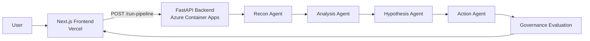
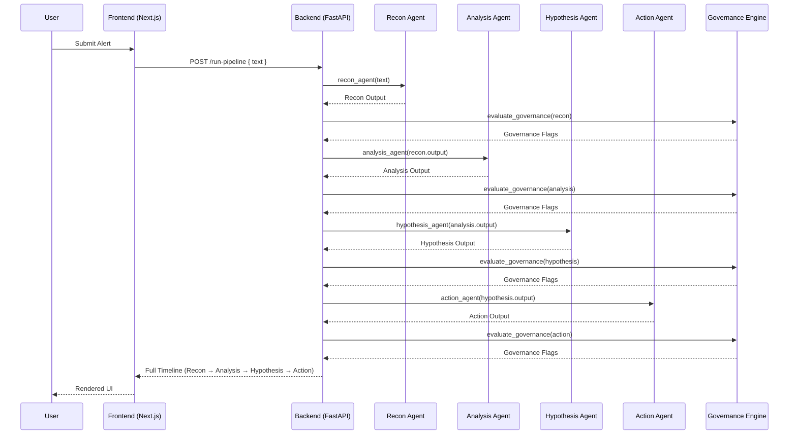
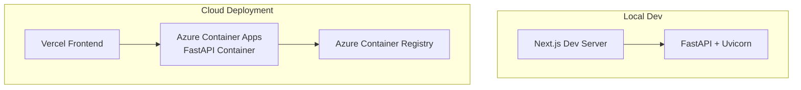

# **SentinelFlow — Agentic Security Pipeline**  
A lightweight, agent‑driven security analysis pipeline designed for demos, workshops, and rapid prototyping. SentinelFlow showcases how multi‑agent reasoning, governance enforcement, and structured security insights can be orchestrated through a clean FastAPI backend and a minimal Next.js frontend.

This demo version is intentionally small, inexpensive to run, and easy to deploy — while still demonstrating the core architectural patterns of modern AI security systems.

---

## **High‑Level Architecture**



---

## **Agent Pipeline (Detailed)**



---

## **Deployment Topology**



---

## **Features**

- Multi‑agent security reasoning  
- Structured JSON outputs  
- Risk scoring  
- Governance enforcement (sandbox, approval-required)  
- Timeline‑style results  
- Minimal, clean UI  
- Cloud‑native deployment  
- Zero‑cost demo footprint  

---

## **Backend Setup (FastAPI + Azure Container Apps)**

### **Local Development**

```bash
uvicorn app.main:app --reload
```

### **Docker Build**

```bash
docker build -t sentinelflow-backend:latest .
```

### **Push to Azure Container Registry**

```bash
az acr login --name sentinelflowacr
docker tag sentinelflow-backend:latest sentinelflowacr.azurecr.io/sentinelflow-backend:latest
docker push sentinelflowacr.azurecr.io/sentinelflow-backend:latest
```

### **Deploy / Update Azure Container App**

```bash
az containerapp update --name sentinelflow-backend --resource-group sentinelflow-rg --image sentinelflowacr.azurecr.io/sentinelflow-backend:latest
```

Azure automatically creates a new revision.

---

## **Frontend Setup (Next.js + Vercel)**

### **Install dependencies**

```bash
npm install
```

### **Environment variable**

Create `.env.local`:

```
NEXT_PUBLIC_API_URL=https://<your-container-app-url>
```

### **Run locally**

```bash
npm run dev
```

### **Deploy to Vercel**

```bash
vercel
```

Add the same environment variable in Vercel’s dashboard.

---

## **CORS Configuration**

SentinelFlow enables cross‑origin requests for local dev and Vercel:

```python
app.add_middleware(
    CORSMiddleware,
    allow_origins=["*"],
    allow_credentials=True,
    allow_methods=["*"],
    allow_headers=["*"],
)
```

---

## **Project Structure**

```
sentinel_flow/
  backend/
    app/
      agents/
      governance/
      main.py
    Dockerfile

  frontend/
    app/
      page.tsx
    .env.local
    package.json
```

---

## **Roadmap**

- SOC‑style dashboard  
- Timeline visualization  
- Agent streaming  
- Threat taxonomy mapping  
- Analytics panel  
- Multi‑tenant mode